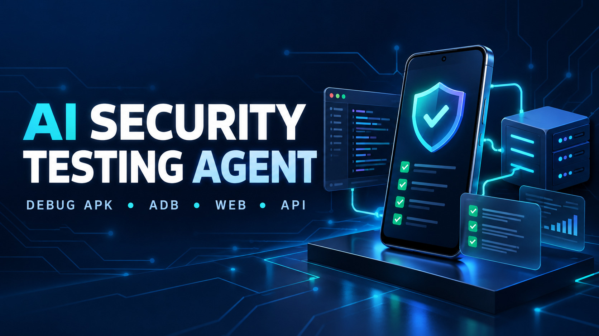
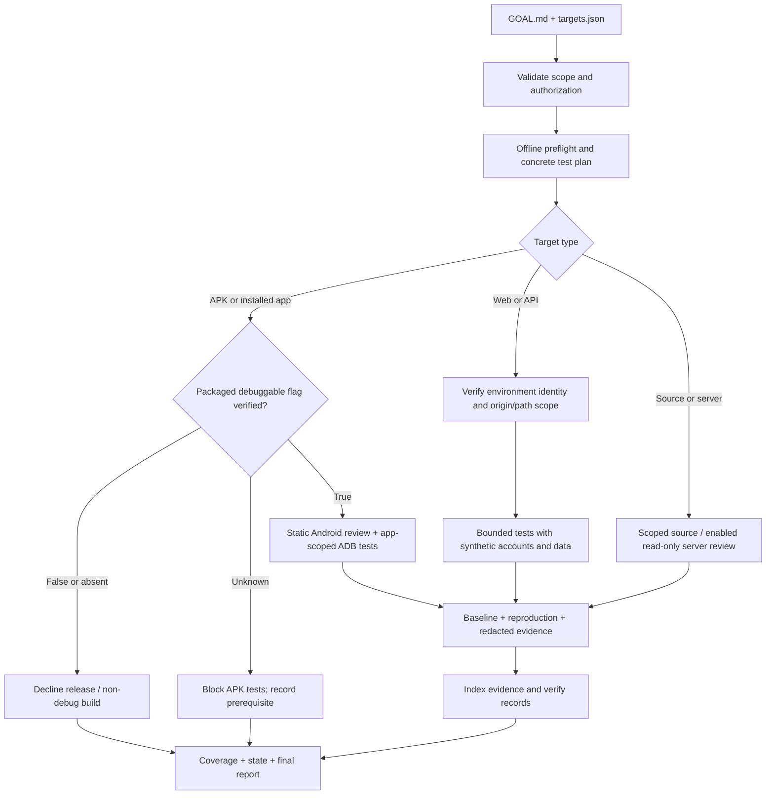
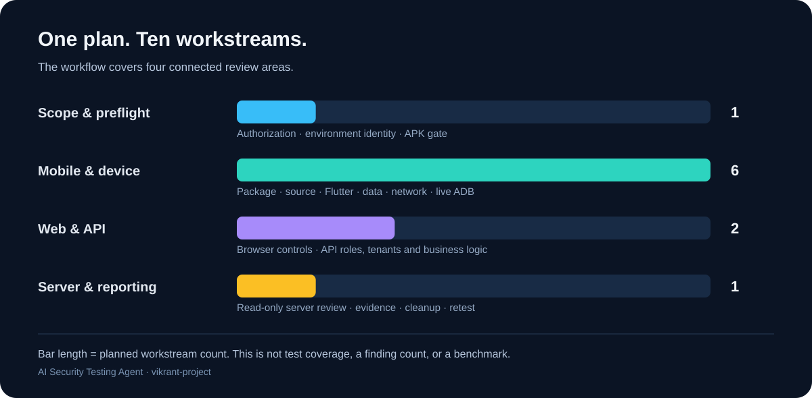
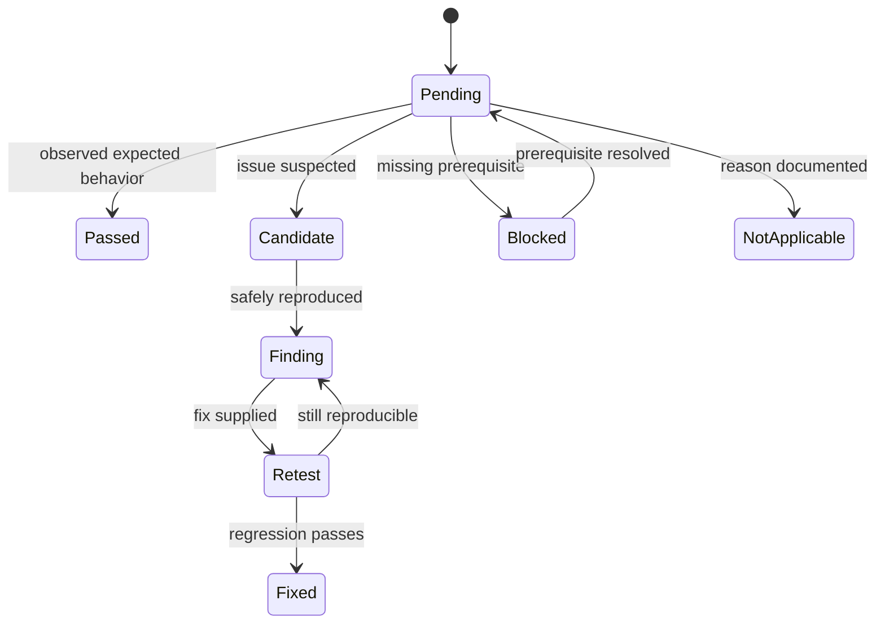

<div align="center">



# AI Security Testing Agent

**Debug APK security testing · ADB live testing · Flutter & Kotlin review · Staging website & API assessments**

[](https://github.com/vikrant-project/ai-security-testing-agent/actions/workflows/validate.yml)
[](LICENSE)
[](scripts/testing_support.py)
[](references/android.md)
[](SKILL.md)

[Quick start](#quick-start) · [What it tests](#what-it-tests) · [How it works](#how-it-works) · [Setup guide](references/setup.md) · [Contribute](CONTRIBUTING.md)

</div>

An open-source **AI agent security-testing skill** for owner-authorized Android debug builds, connected ADB test devices, and local or staging web applications and APIs. Give a tool-capable agent the skill, configure targets once, and use `GOAL.md` to drive an assessment with reproducible findings, explicit coverage, and resumable state.

This repository supplies agent instructions and offline validation helpers. The agent performs the tests with the tools available in its environment. It is not a standalone vulnerability scanner and does not establish that an application is impossible to compromise.

## Why this exists

Security-testing prompts often leave scope, evidence, debug status, and completion criteria unclear. That makes it difficult to tell whether an agent tested the correct build, reproduced an issue, skipped a check, or merely described what a tester could do.

This workflow makes those decisions reviewable:

- **Verify the build before testing.** The APK gate requires an explicit packaged `android:debuggable=true` flag. Release/non-debug builds are declined; unverifiable builds are blocked.
- **Keep scope in one place.** `targets.json` holds declared targets, credential references, owner authorization, and execution limits.
- **Test the actual installed app.** ADB testing verifies the installed APK separately instead of assuming it matches a supplied file.
- **Separate proof from suspicion.** Confirmed findings and unconfirmed candidates have distinct records with reproduction steps and evidence.
- **Resume without losing context.** Coverage, artifact hashes, pending checks, request usage, and temporary changes are saved per run.
- **Show what could not be checked.** Missing tools, accounts, devices, and environment prerequisites remain explicit blockers.

## What it tests

| Target | Example coverage | Prerequisites |
| --- | --- | --- |
| Android debug APK | Manifest, permissions, exported components, deep links, storage, transport, and dependencies | Owner authorization; verified debug APK; Android SDK tooling |
| Kotlin / Java / native Android source | Trust boundaries, secrets, injection paths, cryptography, dependencies, and debug configuration | Declared debug source variant and matching revision where available |
| Flutter / Dart source | Plugins, platform channels, assets, storage, logging, deep links, and client/server trust | Declared debug source variant and relevant tool access |
| Installed app on an ADB device | Happy/negative flows, lifecycle behavior, offline handling, permission denial, crashes, and runtime observations | Dedicated serial, declared package, separately gated installed APK |
| Local or staging website | Browser sessions, access control, input/output handling, CORS, CSRF, headers, and functional regressions | Exact allowed origin/path and environment identity |
| Debug / staging API | Object/property/function authorization, tenant isolation, validation, sessions, and business logic | Test accounts, synthetic data, allowlist, and request budget |
| Private staging server | Scoped read-only service/configuration inspection and deployment separation | Declared host, credential reference, verified identity, and enabled SSH inspection |

Cloud-hosted staging systems, including owner-controlled AWS or Ubuntu deployments, qualify only when explicitly declared. Backend endpoints do not become authorized just because they appear inside a debug APK.

Coverage planning draws on [OWASP MASVS](https://mas.owasp.org/MASVS/), [MASTG](https://mas.owasp.org/MASTG/tests/), [WSTG](https://owasp.org/www-project-web-security-testing-guide/), and [API Security guidance](https://owasp.org/www-project-api-security/). This is an independent project; it does not claim OWASP certification or affiliation.

## Quick start

### 1. Get the skill

```bash
git clone https://github.com/vikrant-project/ai-security-testing-agent.git
cd ai-security-testing-agent
```

Keep the folder intact: `SKILL.md` links to supporting references and scripts. Load it using your agent's supported local-skill mechanism, or ask the agent to read this folder's `SKILL.md` and `GOAL.md`. Exact installation paths depend on your agent. The repository folder name can differ from the declared skill name, `testing-agent`; use the declared name when your agent supports named invocation.

### 2. Configure your targets once

Edit [targets.json](targets.json). Add an explicit owner statement and actual testing/staging targets. Store credential values in your local environment or secret store, never in the JSON or repository.

For example, a local API target can be configured like this; merge these entries into the complete shipped configuration and preserve its `settings` object:

```json
{
  "authorization": {
    "confirmed": true,
    "statement": "I own and authorize testing of the declared local test API.",
    "expires_utc": null
  },
  "targets": [
    {
      "id": "local-api",
      "type": "api",
      "environment": "local",
      "credential_ids": [],
      "origin": "http://127.0.0.1:8080",
      "path_prefixes": ["/api"],
      "identity": {
        "path": "/api/health",
        "contains": "local-test-environment"
      }
    }
  ]
}
```

The endpoint and expected marker must match your actual app. Do not copy example targets as if they were authorized live systems. See the [complete target forms and settings](references/setup.md).

### 3. Start the agent

Use an absolute path appropriate to your machine:

```text
Read /absolute/path/ai-security-testing-agent/SKILL.md and execute
/absolute/path/ai-security-testing-agent/GOAL.md using its targets.json.
Continue autonomously within the declared scope, save resumable state,
and deliver findings, coverage, evidence, and remediation in English.
```

For agents with named skill support, invoke `testing-agent` using that agent's documented syntax. Tool access is required for actual testing; reading Markdown alone cannot control a phone or send requests.

### 4. Run the offline helpers

Python helpers require Python **3.9+** and use only the standard library:

```bash
python scripts/testing_support.py validate-config --config targets.json
python scripts/testing_support.py init --config targets.json
```

On Windows, replace `python` with `py -3` if needed. An unchanged template returns exit **3** because authorization and targets are unconfigured. That is expected fail-closed behavior, not a test result.

The initializer creates records and a starter plan; it does not contact targets or run security tests. The agent expands and executes that plan.

## How it works





The coverage chart groups the **ten planned workstreams**. It shows workflow structure, not findings, detection rates, completed test coverage, or a benchmark.

## The debug-only rule

The gate reads the APK's packaged manifest through Android SDK `apkanalyzer`, checks its flag, and records artifact and manifest hashes. Filenames, signing keys, and source build labels are insufficient.

| Gate result | Exit | Action |
| --- | --- | --- |
| Explicit `android:debuggable=true` | `0` | Admit this artifact; record `admitted: true` |
| False or absent flag | `2` | Decline APK testing |
| Missing tool, malformed/unresolved manifest, or tool failure | `3` | Block APK testing |

The mandatory decline message is:

> Declined: this APK is a release or non-debug build. This testing workflow only accepts verified debug APKs. Provide a debug build with android:debuggable=true.

Windows example, using real local paths and a fresh evidence filename:

```powershell
powershell -NoProfile -ExecutionPolicy Bypass -File scripts/Test-DebugApk.ps1 `
  -ApkPath 'C:\test-artifacts\app-debug.apk' `
  -ApkAnalyzer 'C:\Android\Sdk\cmdline-tools\latest\bin\apkanalyzer.bat' `
  -OutputPath 'runs\ACTUAL_RUN_ID\evidence\apk-gate.json'
```

The process-local execution option does not change machine or user policy. Managed restrictions may still prevent execution. The supplied gate script is Windows-oriented; other systems need equivalent SDK manifest verification with the same admission rules, hashes, and evidence fields.

## Outputs you can review

```text
runs/<unique-run-id>/
├── report.md             Confirmed issues, fixes, limitations, and retest steps
├── findings.json         Confirmed findings and separate candidates
├── coverage.csv          Actual results, pending checks, and blockers
├── state.json            Hashes, gates, requests, cleanup, and resume state
├── scope.json            Configuration snapshot for this run
├── evidence-index.json   Evidence file hashes and sizes
└── evidence/             Redacted requests, logs, screenshots, and gate records
```

Every confirmed issue needs reproducible steps, expected versus observed behavior, demonstrated impact, evidence, and a fix/retest recommendation. Curl responses, app logs, and screenshots are evidence only when actually observed. The workflow never generates screenshots pretending to show an exploit result.



`verify-run` checks record consistency and indexed evidence integrity. It does not prove exploitability, detect every secret, or enforce network restrictions at runtime. Manual review and real reproductions remain necessary.

## Where you can use it

- **Before a release:** assess an authorized debug build and report issues for developers to fix.
- **During Android development:** inspect Kotlin/Java/Flutter changes and repeat app flows on a dedicated test phone.
- **In staging QA:** compare synthetic user roles and tenants against a local/private website or API.
- **For an AI-assisted security review:** give a tool-capable agent consistent scope, evidence, and completion rules.
- **For retesting fixes:** start a fresh run linked to original finding IDs and new artifact hashes.

Avoid production systems, public third-party targets, personal phone content, bulk data extraction, load attacks, and destructive server changes. Instrumentation, APK installation, root-dependent checks, and SSH inspection have explicit configuration switches. See [SKILL.md](SKILL.md) for the full operating boundaries.

## Tests and project structure

```bash
python -m unittest discover -s scripts -p "test_*.py" -v
```

On Windows, also run the parser checks:

```powershell
powershell -NoProfile -ExecutionPolicy Bypass -File scripts/Test-GateBehavior.ps1
```

Regression coverage includes malformed/duplicate configuration, URL boundary and encoding mistakes, expired authorization, evidence changes, scope changes, request budgets, missing finding evidence, false completion, and APK gate/hash relationships. Windows integration fixtures use simulated manifest-tool output; they do not replace real Android SDK verification. Host-dependent symlink tests may be skipped when privileges do not permit them.

| File or folder | Purpose |
| --- | --- |
| [SKILL.md](SKILL.md) | Portable agent entrypoint |
| [GOAL.md](GOAL.md) | Reusable assessment goal |
| [targets.json](targets.json) | Empty configuration template |
| [references/setup.md](references/setup.md) | Target forms, credentials, and helper commands |
| [references/coverage.md](references/coverage.md) | Ten-workstream coverage planner |
| [references/android.md](references/android.md) | Debug APK and ADB procedures |
| [references/web-api.md](references/web-api.md) | Website, API, server, and curl evidence procedures |
| [references/execution.md](references/execution.md) | Checkpoints, budgets, resume, and retest |
| [references/reporting.md](references/reporting.md) | Evidence and final-review rules |
| [scripts/](scripts/) | Offline helpers, Windows APK gate, and regression tests |

## Contribute and share

Useful contributions include reproducible helper bugs, clearer instructions, tested target examples, and new checks with scope and evidence requirements. Read [CONTRIBUTING.md](CONTRIBUTING.md) before opening an issue or pull request. Report sensitive vulnerabilities using [SECURITY.md](SECURITY.md), without posting credentials, private APKs, or unredacted results publicly.

If this workflow helps your project, a star, a link from your own testing documentation, or a reproducible example makes it easier for other developers to evaluate it. No paid stars, keyword stuffing, or invented endorsements are used.

**Share keywords:** `#AISecurity` `#AgentSkills` `#AndroidSecurity` `#DebugAPK` `#ADB` `#Flutter` `#Kotlin` `#APISecurity` `#WebSecurity` `#SecurityTesting` `#OWASP`

Repository topics, descriptive documentation, and relevant links help discovery. Search engines and AI search systems determine their own indexing and rankings; this project cannot promise first place or instant indexing.

## License

[MIT](LICENSE) · Maintained by [vikrant-project](https://github.com/vikrant-project).
